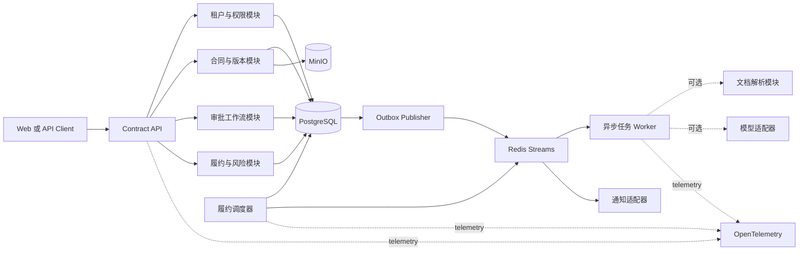
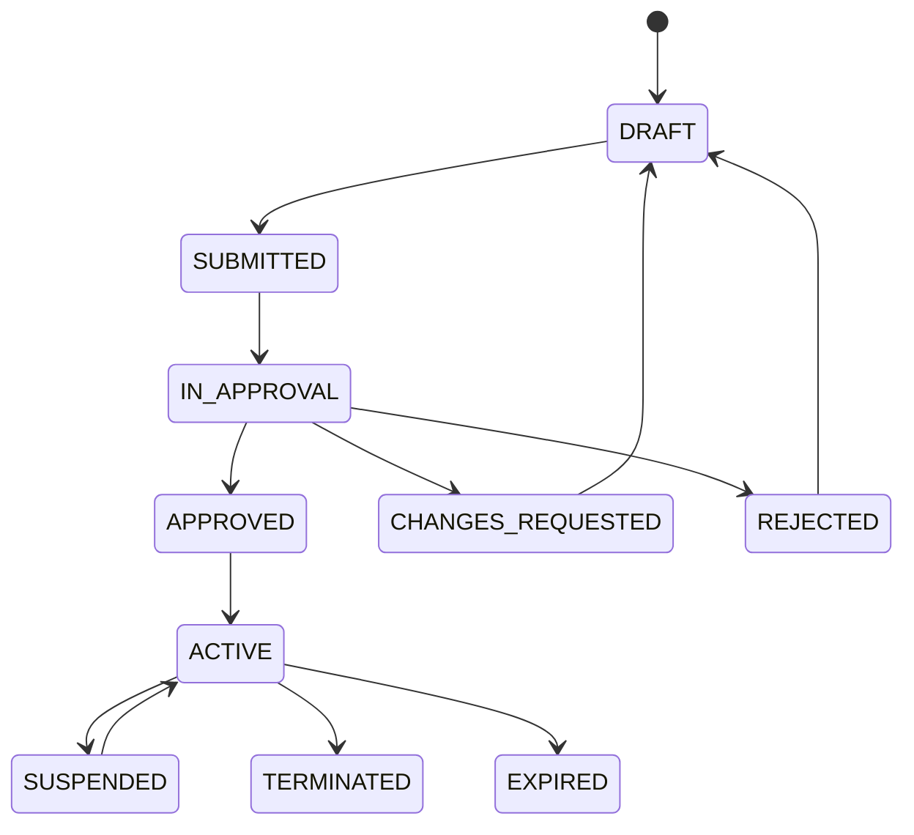

# ContractOps 审批与履约风控实施计划

## 1 项目目标

ContractOps 建设为一个边界清晰、可运行、可测试和可压测的企业合同后端服务。核心
交付不是 PDF 检查页面，而是一条可以恢复、追踪和审计的合同业务链路：

```text
合同建档
→ 版本提交
→ 审批策略匹配
→ 多角色审批
→ 合同生效
→ 履约义务登记
→ 到期风险识别
→ 提醒和升级
→ 风险关闭
```

首版重点验证企业后端能力：多租户权限、状态机、事务一致性、幂等、异步任务、调度、
审计、可观测和故障恢复。文档解析与模型提示作为后续增强，不阻塞主链路交付。

## 2 产品边界

### 2.1 必须完成

- 合同台账和不可变版本；
- 审批策略、审批实例、审批步骤和个人待办；
- 法务、财务和业务三类角色的审批闭环；
- 付款、交付、验收、续约和终止通知等履约义务；
- 即将到期、逾期和缺少证据等风险事件；
- 提醒去重、失败重试、超时升级和任务恢复；
- 租户隔离、部门数据范围、操作审计和业务审计；
- 可复现的集成测试、故障测试和性能报告。

### 2.2 后续增强

- PDF/DOCX 解析、页码定位和条款证据；
- 条款分类、金额日期提取和版本 Diff；
- 模型辅助风险提示和义务候选项生成；
- Webhook 之外的邮件、钉钉或飞书通知适配器；
- 并行会签、加签和更复杂的审批表达式。

### 2.3 明确排除

- 通用 PDF Inspector；
- 通用知识库和文档问答；
- 自动批准合同或自动给出最终法律意见；
- 在线合同编辑器、电子签章和支付；
- 第一阶段使用 Kafka、OpenSearch、Kubernetes 或多 Agent。

## 3 服务架构



第一阶段采用模块化单体 API、独立 Worker 和独立 Scheduler。模块之间通过应用层端口
和领域事件协作，不通过 HTTP 互相调用。只有出现独立扩容、独立发布或团队所有权需求
时才拆分微服务。

## 4 代码结构

```text
services/contract-api/
├─ src/contractops/
│  ├─ api/                     # HTTP 路由 DTO 和错误映射
│  ├─ domain/
│  │  ├─ contracts/           # 合同和版本生命周期
│  │  ├─ approvals/           # 策略 实例 步骤和决定
│  │  ├─ obligations/         # 履约义务和完成证据
│  │  ├─ risks/               # 风险事件 升级和关闭
│  │  └─ shared/              # 标识 值对象 领域事件
│  ├─ application/            # 用例 事务边界和权限检查
│  ├─ infrastructure/
│  │  ├─ postgres/            # Repository Unit of Work 和 RLS
│  │  ├─ redis/               # Streams 幂等记录和锁
│  │  ├─ object_storage/      # MinIO 适配器
│  │  ├─ notifications/       # Webhook 和日志通知
│  │  └─ intelligence/        # 文档解析与模型适配器
│  ├─ workers/                # Outbox 消费者和后台任务
│  ├─ scheduler/              # 履约任务领取和调度
│  ├─ middleware/             # 请求上下文 鉴权和追踪
│  ├─ config.py
│  └─ main.py
├─ migrations/
├─ tests/
│  ├─ unit/
│  ├─ integration/
│  ├─ contract/
│  └─ performance/
├─ Dockerfile
└─ pyproject.toml
```

`domain` 不依赖 FastAPI、数据库、Redis 或模型 SDK。`application` 负责用例和事务边界，
`infrastructure` 实现端口。审批规则、义务状态和风险升级逻辑可以脱离外部服务测试。

## 5 领域模型

| 聚合或实体 | 主要职责 | 关键并发控制 |
| --- | --- | --- |
| Contract | 合同编号、交易对手、金额、归属和生命周期 | `state_version` 乐观锁 |
| ContractVersion | 不可变文件版本、内容哈希和处理状态 | 内容哈希部分唯一索引 |
| ApprovalPolicy | 审批条件、步骤模板、版本和启停状态 | 发布后不可原地修改 |
| ApprovalInstance | 一次针对合同版本的审批流程和策略快照 | 单版本单活动实例 |
| ApprovalStep | 审批人、角色、顺序、截止时间和决定 | 幂等键加步骤版本 |
| Obligation | 履约类型、负责人、计划时间、宽限期和状态 | 状态版本和任务租约 |
| RiskEvent | 风险类型、等级、来源、负责人和处置状态 | 活动风险唯一约束 |
| OutboxEvent | 与业务事务一起写入的待发布事件 | `event_id` 唯一 |
| AuditEvent | 追加写的操作和业务审计记录 | 禁止更新和删除 |

审批实例必须保存策略快照。管理员修改审批策略后，已经开始的审批仍按照原快照执行，
避免同一合同在流程中途改变审批条件。

## 6 状态机

### 6.1 合同生命周期



文件解析状态独立保存为 `PENDING`、`PROCESSING`、`READY`、`FAILED`。解析失败不能改变
已经存在的合同生命周期，避免技术任务状态污染业务状态。

### 6.2 审批步骤状态

```text
PENDING → READY → CLAIMED → APPROVED
                    ├──────→ REJECTED
                    ├──────→ CHANGES_REQUESTED
                    └──────→ TRANSFERRED

READY 或 CLAIMED → EXPIRED → ESCALATED
```

每个决定都要求操作者权限、步骤当前状态、`state_version` 和 `Idempotency-Key` 同时满足。
数据库更新成功后写入 Outbox 和 AuditEvent，不能在事务提交前直接发送通知。

### 6.3 履约义务状态

```text
PLANNED → ACTIVE → COMPLETED
              ├──→ OVERDUE → COMPLETED
              ├──→ WAIVED
              └──→ CANCELLED
```

义务逾期会创建或更新活动 RiskEvent，但不会自动判定合同违约。风险事件需要负责人确认、
升级、延期或关闭。

## 7 核心流程

### 7.1 合同提交与策略匹配

```text
创建合同和版本
→ 校验结构化字段
→ 提交审批
→ 按优先级匹配已发布策略
→ 固化策略快照
→ 创建审批实例与步骤
→ 激活第一个待办
→ 写入 Outbox 和审计事件
```

策略条件首版只支持受控字段和操作符，例如合同类型、金额区间、部门和风险标签。不得
直接执行管理员提交的 Python、SQL 或任意表达式。

### 7.2 审批决定

```text
读取待办并校验权限
→ 校验 Idempotency-Key
→ 使用 state_version 更新步骤
→ 计算下一可执行步骤
→ 更新审批实例和合同状态
→ 同事务写 Outbox 和 AuditEvent
→ 异步发送通知
```

重复请求返回第一次决定的结果。两个审批人并发操作同一步骤时只有一个更新成功，另一
请求返回版本冲突，不允许最后写入覆盖先前决定。

### 7.3 履约任务与风险升级

```text
登记并确认义务
→ Scheduler 按 next_action_at 领取租约
→ 写入 obligation.due 事件
→ Consumer 创建风险事件和提醒记录
→ Notification Adapter 发送通知
→ 到期未完成时提高风险等级并通知上级
```

领取使用 `lease_owner` 和 `lease_until`。提醒使用
`(obligation_id, reminder_type, scheduled_at)` 唯一键。Worker 崩溃后租约到期可重新
领取，重复事件不会产生第二条通知。

### 7.4 文档和模型辅助

文档 Worker 可以提取正文、页码、金额、日期和条款候选项。模型输出经过 JSON Schema
和确定性规则校验后，只保存为草稿或 Finding。人工确认后才能转成审批风险标签或履约
义务。该流程关闭时，用户仍可通过结构化字段完成合同审批与履约管理。

## 8 多租户和权限

- JWT 提供 `tenant_id`、`user_id`、角色和部门声明，不接受客户端自定义租户头；
- API 在进入用例前构建请求上下文，Repository 不接受裸 `tenant_id` 参数；
- 每个事务执行 `SET LOCAL app.tenant_id` 和 `SET LOCAL app.user_id`；
- PostgreSQL RLS 作为应用权限之外的第二道防线；
- 角色权限与部门数据范围分开计算；
- 对象键、缓存键、幂等键、Stream 消费记录都包含租户；
- 审计日志只记录必要字段、对象标识和结果，不记录合同全文或令牌。

首版权限：经办人管理自己或本部门合同，审批人只处理分配的步骤，法务管理员管理策略，
审计员只读审计数据，平台管理员不能读取租户合同正文。

## 9 API 草案

| 方法 | 路径 | 说明 |
| --- | --- | --- |
| `POST` | `/v1/contracts` | 创建合同台账 |
| `GET` | `/v1/contracts/{id}` | 查询合同摘要和生命周期 |
| `POST` | `/v1/contracts/{id}/versions` | 创建不可变版本 |
| `POST` | `/v1/contracts/{id}:submit` | 提交审批并匹配策略 |
| `GET` | `/v1/approval-tasks` | 查询当前用户待办 |
| `POST` | `/v1/approval-steps/{id}:claim` | 领取审批步骤 |
| `POST` | `/v1/approval-steps/{id}:decide` | 通过、驳回或退回修改 |
| `POST` | `/v1/approval-steps/{id}:transfer` | 转交审批步骤 |
| `GET` | `/v1/approval-instances/{id}` | 查询审批进度和历史 |
| `POST` | `/v1/approval-policies` | 创建审批策略草稿 |
| `POST` | `/v1/approval-policies/{id}:publish` | 发布不可变策略版本 |
| `POST` | `/v1/contracts/{id}/obligations` | 登记履约义务 |
| `POST` | `/v1/obligations/{id}:complete` | 提交完成证据 |
| `GET` | `/v1/risk-events` | 查询履约风险事件 |
| `POST` | `/v1/risk-events/{id}:resolve` | 关闭或延期风险事件 |
| `GET` | `/v1/audit-events` | 按权限查询审计事件 |

写接口统一支持 `Idempotency-Key` 和 `X-Request-ID`。列表使用游标分页。错误返回稳定的
业务错误码、请求 ID 和可安全展示的信息，不返回堆栈或数据库细节。

## 10 异步事件

首批事件：

```text
contract.submitted.v1
approval.instance.started.v1
approval.step.ready.v1
approval.step.decided.v1
approval.instance.completed.v1
contract.activated.v1
obligation.activated.v1
obligation.due.v1
obligation.overdue.v1
risk.event.created.v1
risk.event.escalated.v1
risk.event.resolved.v1
```

事件包含 `event_id`、`event_type`、`schema_version`、`tenant_id`、`aggregate_id`、
`occurred_at`、`request_id`、`trace_id` 和最小必要 payload。消费者根据 `event_id` 记录
处理结果。事件不携带合同全文、访问令牌或不必要的个人信息。

## 11 八周制作计划

### M0 工程基线 第 1 周

- 整理 FastAPI 应用工厂、配置、统一错误和请求上下文；
- 将初始 SQL 纳入 Alembic 或等价迁移管理；
- 建立 PostgreSQL、Redis、MinIO 和 API 的测试 Compose；
- CI 执行 lint、类型检查、单测和空库迁移检查。

验收：API 可启动，迁移可以在空数据库执行两次，非法状态迁移被拒绝，测试命令有稳定
入口。

### M1 多租户与合同台账 第 2 周

- JWT 租户上下文、RBAC 和部门数据范围；
- Contract 与 ContractVersion Repository；
- RLS、对象键和幂等键的租户隔离；
- 创建、查询和版本新增接口。

验收：两个租户不能互相读取；重复请求不产生重复版本；合同版本不能覆盖；越权访问
返回稳定错误码。

### M2 审批策略和待办 第 3 周

- ApprovalPolicy 版本、发布和受控条件匹配；
- ApprovalInstance 策略快照；
- 顺序审批、条件跳过和个人待办查询；
- 领取、通过、驳回、退回修改和转交。

验收：高金额合同自动增加财务步骤；策略发布后不可原地修改；并发审批只有一个决定
生效；旧审批不受新策略影响。

### M3 可靠事件与通知 第 4 周

- Transactional Outbox；
- Redis Streams Consumer Group；
- 消费者幂等、重试、死信和人工重放；
- Webhook 和日志通知适配器。

验收：事务回滚不发送事件；重复投递不产生重复通知；杀死 Worker 后任务恢复；死信可
查询和重放。

### M4 履约与风险事件 第 5 周

- Obligation Repository 和状态机；
- 数据库租约、到期扫描和批量领取；
- RiskEvent 创建、升级、延期和关闭；
- 提醒去重与合同终止后的任务取消。

验收：服务重启不漏任务；同一提醒只发送一次；逾期风险按规则升级；被终止合同不再
生成后续提醒。

### M5 审计和可观测 第 6 周

- 操作、业务和安全审计事件；
- OpenTelemetry trace、结构化日志和 Prometheus 指标；
- 从 API 到数据库、Outbox、Worker 和通知的关联追踪；
- 管理端运行指标和失败任务查询接口。

验收：能够从一个请求 ID 找到审批决定、事件发布和通知结果；日志不包含合同正文和
令牌；关键失败有指标和告警条件。

### M6 文档辅助和版本 Diff 第 7 周

- MinIO 预签名上传和完成上传接口；
- PDF/DOCX 正文、页码和标题结构解析；
- 金额日期提取、条款证据和版本 Diff；
- 模型辅助风险标签与义务候选项，默认可关闭。

验收：关闭模型后主链路仍可运行；每条提示保留版本、页码和原文；非法模型输出不进入
业务状态；旧引用可以继续访问。

### M7 故障验证和压测 第 8 周

- API、Repository、Worker 和 Scheduler 集成测试；
- Worker 崩溃、Redis 暂停和通知失败的故障注入；
- k6 或 Locust 压测；
- 安全检查、运行手册和最终演示脚本。

验收：形成真实 QPS、P95、审批冲突率、任务恢复率、重复通知率和单合同资源成本报告。

## 12 测试矩阵

| 类型 | 必测内容 |
| --- | --- |
| 领域单元测试 | 合同、审批步骤、义务和风险事件状态迁移 |
| 权限测试 | 租户隔离、部门范围、越权审批和审计员只读 |
| Repository 集成测试 | 事务、RLS、唯一约束、乐观锁和 Outbox 原子性 |
| API 契约测试 | 错误结构、分页、幂等、权限和版本兼容 |
| Worker 测试 | 重复事件、崩溃恢复、超时、死信和重放 |
| Scheduler 测试 | 租约竞争、时钟边界、提醒去重和任务取消 |
| 安全测试 | 恶意文件、Prompt 注入、SSRF、令牌泄漏和审计绕过 |
| 性能测试 | 合同列表、待办列表、并发审批、批量调度和审计查询 |

## 13 核心指标

只有真实测试结果才能写入项目简历。计划采集：

- 合同创建和待办查询的 QPS 与 P50、P95、P99；
- 并发审批冲突检测正确率；
- 重复请求产生重复决定的数量；
- Worker 崩溃后的任务恢复率和恢复时间；
- 到期任务扫描延迟和重复通知率；
- 跨租户和越权用例拦截率；
- Outbox 发布延迟和死信数量；
- 单合同审批与履约流程的数据库和模型成本。

## 14 第一批实现任务

按以下顺序推进：

1. 将迁移纳入 Alembic 或等价管理，并补空库迁移与回滚测试。
2. 实现 JWT 请求上下文、RBAC、部门数据范围和事务级 RLS 设置。
3. 实现 Contract、ContractVersion Repository 与创建、查询接口。
4. 新增 ApprovalPolicy、ApprovalInstance、ApprovalStep 数据模型和迁移。
5. 实现审批策略匹配、策略快照、提交审批和个人待办接口。
6. 实现审批决定的幂等、乐观锁、审计事件和 Outbox 原子写入。
7. 建立 Redis Streams Publisher 与 Consumer 骨架，再进入履约调度。

在前六项完成并通过数据库集成测试之前，不开始模型路由、复杂 RAG、前端工作台或
Kubernetes。
